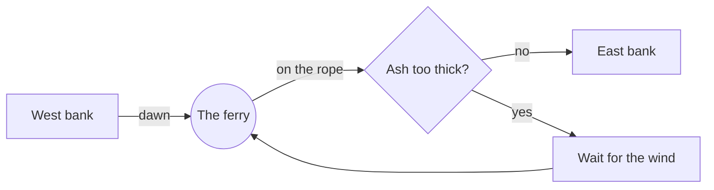
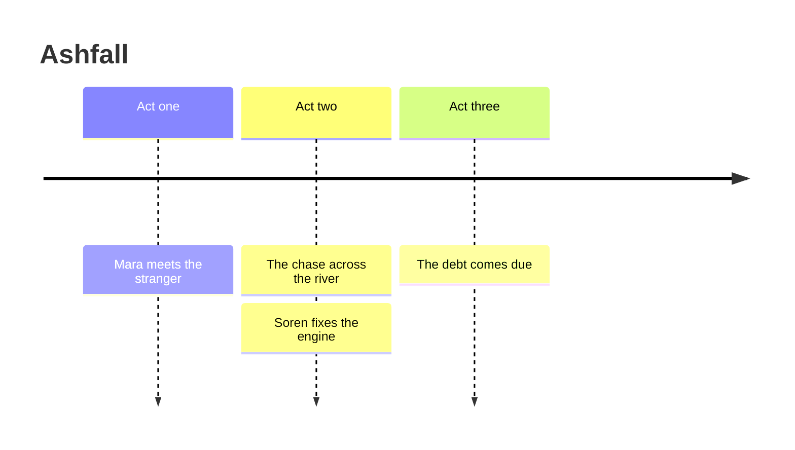

How the ferry crosses, for the chase in act two. Fares are in [[Crossings]], and the cast is in
[the cast list](Records/cast.json).

> The rope is older than the boat.

```mermaid
flowchart LR
  West[West bank] -->|dawn| Ferry((The ferry))
  Ferry -->|on the rope| Mid{Ash too thick?}
  Mid -- no --> East[East bank]
  Mid -- yes --> Wait[Wait for the wind]
  Wait --> Ferry
```

## Acts

```mermaid
timeline
  title Ashfall
  Act one : Mara meets the stranger
  Act two : The chase across the river : Soren fixes the engine
  Act three : The debt comes due
```
